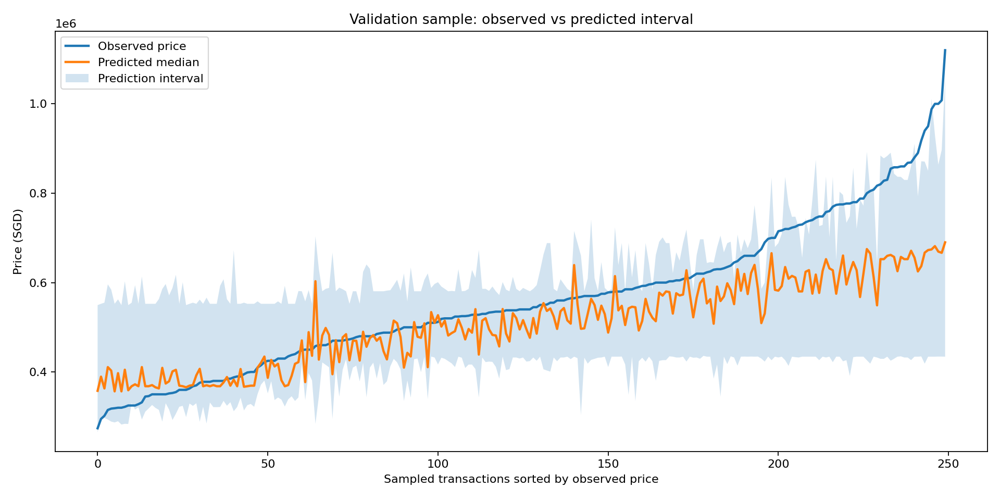
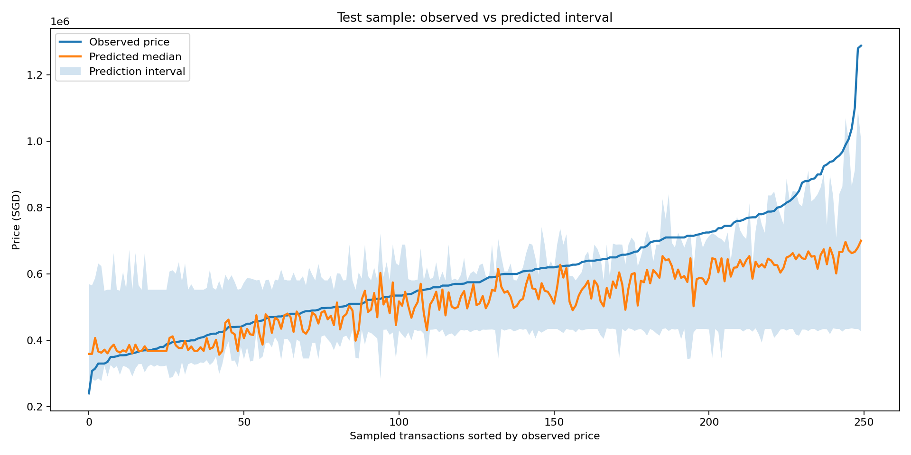

# Singapore House Pricing

End-to-end machine learning project for estimating fair resale price ranges for Singapore HDB flats.

## Business question

How can we support buyers, sellers, and analysts with a realistic price range instead of a single price point?

In real estate, uncertainty matters. A pricing workflow is more useful when it shows a lower bound, a central estimate,
and an upper bound that teams can use for negotiation, screening, and manual review.

## What this project does

- Uses HDB resale transactions from 2020 to 2024
- Combines property features with a Singapore housing price index
- Builds leakage-safe historical market features by town and street
- Trains quantile regression models for P10, P50, and P90 price estimates
- Evaluates performance with time-based validation and test splits

## Why it matters for the business

- A valuation band is more useful than a single number for negotiation and risk management
- Wider predicted intervals can signal listings that need analyst review
- Time-based evaluation shows how the model behaves in future market conditions, not only on random historical samples

## Full-run results

The current artifacts in this repository were generated from the full dataset run.

| Split | MAE | MAPE | Coverage | Mean interval width |
| --- | ---: | ---: | ---: | ---: |
| Validation | SGD 76,372 | 11.44% | 80.63% | SGD 260,048 |
| Test | SGD 89,579 | 13.05% | 74.30% | SGD 261,070 |

## Business interpretation

- The model's central estimate stays within roughly 11% to 13% of the final sale price on average, which is useful for pricing support and shortlist ranking.
- Validation coverage is close to the expected 80% interval behavior, so the prediction bands are directionally reliable in stable periods.
- Test coverage falls to about 74% in the out-of-time 2024 window, which suggests market drift and supports regular retraining.
- The average interval width is around SGD 260k, so this model should be used as decision support, not as a fully automated final valuation engine.
- Listings with especially wide intervals are good candidates for manual analyst review.

## Example outputs

Validation sample:



Test sample:



## How to run

Run the complete project from setup to outputs with:

```bash
./scripts/run_project.sh --full
```

For a faster smoke test:

```bash
./scripts/run_project.sh
```

## Generated artifacts

After execution, the project creates:

- `data/processed/sg_resale_flat_prices_engineered.csv`
- `data/processed/features_list.json`
- `models/quantile_10.joblib`
- `models/quantile_50.joblib`
- `models/quantile_90.joblib`
- `models/model_metadata.json`
- `reports/metrics.json`
- `reports/predictions.csv`
- `reports/project_summary.md`
- `reports/figures/*.png`
